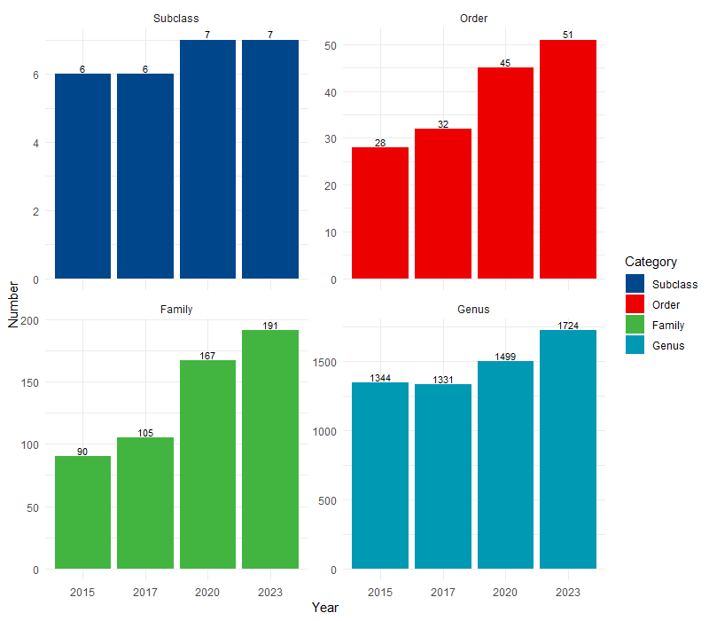
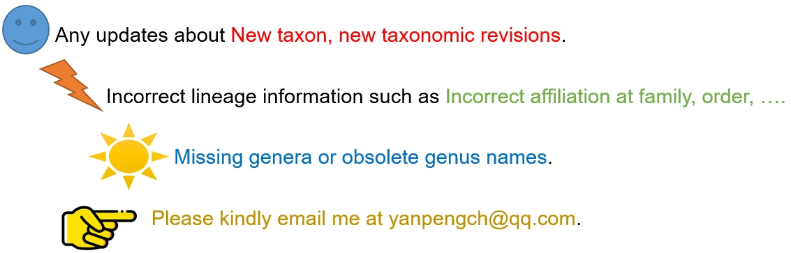

# FungiOutline
 A R package written by Yanpeng Chen for processing taxonomic framework of Fungi.

 The following bar chart displays the changes in the number of subclasses, orders, families and genus within Sordariomycetes. Some of theme are not well accepted by fungal taxonomist. 
 

 # Join me
  

# Usage

## Install & update
```
library(devtools)
devtools::install_github("ypchan/FungiOutline")
```
## Get the taxonomic framework
```
library(FungiOutline)
data(outline)
```

## Count
```
# how many phylum, including incertae_sedis
outline %>% distinct(Phylum) %>% print(n=100)

# how many family, including incertae_sedis
outline %>% distinct(Current_family) %>% print(n=5000)

# how many genus, including incertae_sedis
outline %>% distinct(Current_family) %>% print(n=5000)

```
## Annotation lineage information
```
# file:  taxa table in XLSX format
# query_column_name: the column including taxonimic terms such as the name of genus, family, order...
file <- "2022-studies in mycology-Taxonomy.xlsx"
add_lineage_to_xlsx(file,query_column_name = "Genus")
```

## Reference

> 1. Maharachchikumbura S S N, Hyde K D, Jones E B G, et al. Towards a natural classification and backbone tree for Sordariomycetes. Fungal Diversity, 2015, 72(1): 199–301.
> 2. Hongsanan S, Maharachchikumbura S S N, Hyde K D, et al. An updated phylogeny of Sordariomycetes based on phylogenetic and molecular clock evidence. Fungal Diversity, 2017, 84(1): 25–41.
> 3. Hyde K D, Norphanphoun C, Maharachchikumbura S, et al. Refined families of Sordariomycetes. Mycosphere, 2020, 11(1): 305–1059.
